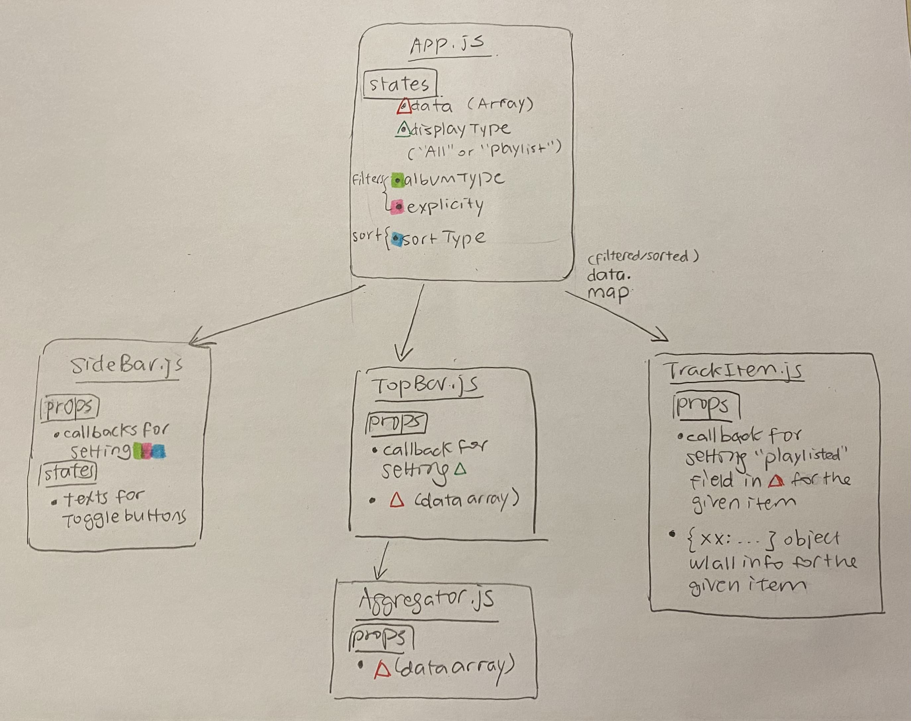

# Spotify Top 100 Songs of 2022 

### Link to Deployed Website
[https://nostalgicalpaca202.github.io/development-assignment](https://nostalgicalpaca.github.io/development-assignment)

### Goal and Value of the Application
This application shows all songs in the Spotify playlist [*TOP 100 Songs of 2022 (Best Hit Music Playlist)*](https://open.spotify.com/playlist/1EVE9kOZ2i4171hNdvWVhU). You are able to view more information about the songs in this application than on the Spotify playlist! For example, you can see the popularity of the song - a score calculated by Spotify's algorithm. In addition, you can sort and apply filters to the songs. This application also allows you to add and remove songs to a "playlist".

### Usability Principles Considered
- To ensure easy access to the filters/sorting and the playlist aggregator, the side bar and the top bar are sticky to the side/top so that users can still quickly access them as they scroll
- Used the Gestalt principles of proximity and similarity for each of the items, so that it is clear that they are part of a group

### Organization of Components, Props, and States
There are three main components in the app: 
- A side bar (`SideBar.js`) that contains all the buttons for sorting and filtering.
- A top bar (`TopBar.js`) that contains the title, the button to switch to My Playlist, and the aggregator (showing the total number of tracks and total duration of all the songs in My Playlist). The aggregator is packaged into its own component (`Aggregator.js`).
- A component that contains information about each song/track (`TrackItem.js`), including the image, name, popularity, etc.

Here is a breakdown of the props and states of each component:
- The side bar: 
  - props include
    - Three callback functions that alter the states in `App.js` that are related to sorting and filtering
  - The states in the side bar are essentially just the text used in MUI's toggle buttons, which I used for sorting/filtering
- The top bar: 
  - props include
    - A callback function that alters a state called `displayType` in `App.js` that controls whether to display only items in My Playlist
    - An array called `allData` that contains all the information on each item
  - No states are used in this component
- The aggregator: 
  - The only prop used is the `allData` array, passed down from the top bar
  - No states are used in this component
- The track item:
  - props include
    - A callback function that adds or removes the item from My Playlist
    - The object that contains all the information on the item
  - No states are used in this component

